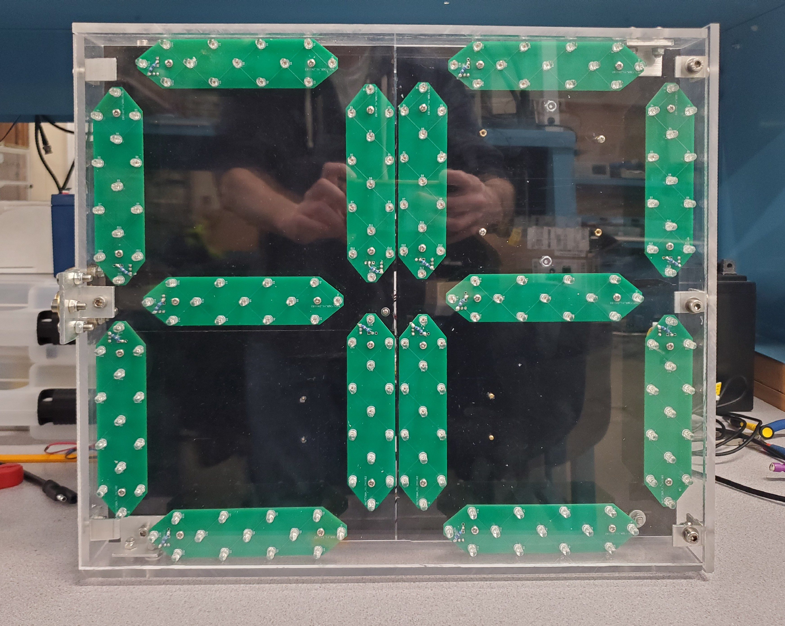

<!-- Improved compatibility of back to top link: See: https://github.com/othneildrew/Best-README-Template/pull/73 -->
<a id="readme-top"></a>
<!--
*** Thanks for checking out the Best-README-Template. If you have a suggestion
*** that would make this better, please fork the repo and create a pull request
*** or simply open an issue with the tag "enhancement".
*** Don't forget to give the project a star!
*** Thanks again! Now go create something AMAZING! :D
-->


<!-- PROJECT SHIELDS -->
<!--
*** I'm using markdown "reference style" links for readability.
*** Reference links are enclosed in brackets [ ] instead of parentheses ( ).
*** See the bottom of this document for the declaration of the reference variables
*** for contributors-url, forks-url, etc. This is an optional, concise syntax you may use.
*** https://www.markdownguide.org/basic-syntax/#reference-style-links
-->

<!-- TEMPORARILY REMOVING THESE
[![Contributors][contributors-shield]][contributors-url]
[![Forks][forks-shield]][forks-url]
[![Stargazers][stars-shield]][stars-url]
[![Issues][issues-shield]][issues-url]
[![MIT License][license-shield]][license-url]

-->

<!-- PROJECT LOGO -->
<br />
<div align="center">
  <a href="https://github.com/newt-ttt/SpeedSense">
    
  </a>

<h3 align="center">Speed Sense</h3>

  <p align="center">
    Speed Sense is the result of UMass Amherst Senior Design Project Team 18's hard work. This repository contains the web app to go alongside the hardware we've built to bring an affordable, easy-to-use dynamic speed display sign (DSDS) to the hands of consumers. 
    <br />
    <!--
    <a href="https://github.com/newt-ttt/SpeedSense"><strong>Explore the docs »</strong></a>
    <br />
    <br />
    <a href="https://github.com/newt-ttt/SpeedSense">View Demo</a>
    ·
    <a href="https://github.com/newt-ttt/SpeedSense/issues/new?labels=bug&template=bug-report---.md">Report Bug</a>
    ·
    <a href="https://github.com/newt-ttt/SpeedSense/issues/new?labels=enhancement&template=feature-request---.md">Request Feature</a>
    -->
  </p>
</div>


<!-- TABLE OF CONTENTS -->
<details>
  <summary>Table of Contents</summary>
  <ol>
    <li>
      <a href="#about-the-project">About The Project</a>
      <ul>
        <li><a href="#built-with">Built With</a></li>
      </ul>
    </li>
    <li>
      <a href="#getting-started">Getting Started</a>
      <ul>
        <li><a href="#prerequisites">Prerequisites</a></li>
        <li><a href="#installation">Installation</a></li>
      </ul>
    </li>
    <li><a href="#usage">Usage</a></li>
    <li><a href="#issues">Roadmap</a></li>
    <li><a href="#license">License</a></li>
    <li><a href="#contact">Contact</a></li>
    <li><a href="#acknowledgments">Acknowledgments</a></li>
  </ol>
</details>


<!-- ABOUT THE PROJECT -->
## About The Project
<!--
[![Product Name Screen Shot][product-screenshot]](https://example.com)
-->

<!--
Here's a blank template to get started: To avoid retyping too much info. Do a search and replace with your text editor for the following: `newt-ttt`, `SpeedSense`, `twitter_handle`, `linkedin_username`, `email_client`, `email`, `project_title`, `project_description`
-->
<p align="right">(<a href="#readme-top">back to top</a>)</p>


### Built With

[![Django][Django]][Django-url]

<p align="right">(<a href="#readme-top">back to top</a>)</p>


<!-- GETTING STARTED -->
## Getting Started

To get a local instance of the Speed Sense web app up and running, follow these example steps:
### Preface
Don't worry if you don't have a secret_tokens.py file yet -- it will be generated on the first run of the server

### Prerequisites

To run this application, you'll need Git and Python. You can download the latest version of Python [here](https://www.python.org/downloads/) and Git [here](https://git-scm.com/downloads)


### Installation

1. Download the latest release or clone this repository
   ```sh
   git clone https://github.com/newt-ttt/SpeedSense.git
   ```
2. Install Python packages
   ```sh
   python -m pip install -r requirements.txt
   ```

3. Run the following commands in this order
   ```sh
    python manage.py makemigrations WebApp
    python manage.py migrate
    python manage.py runserver
   ```
By default, the server will start locally at http://127.0.0.1:8000/

### Tunneling
To tunnel with pagekite, we provided the host.bat file in order to make things easier:

1. Download 'pagekite.py' from [pagekite](https://pagekite.net/) & place it in the same directory as the root SpeedSense folder (NOT INSIDE IT)

2. Add your credentials to your pagekite installation (see [pagekite documentation](https://pagekite.net/wiki/))

3. Modify 'host.bat' to point to your own pagekite URL

4. Run './host.bat' to make the server accessible at 'speedsense.pagekite.me' (Or your own pagekite URL)


### Communicating with a Speed Sense device
Navigate to the Setup section of the web app in order to begin communicating with your Speed Sense device.
<p align="right">(<a href="#readme-top">back to top</a>)</p>


<!-- USAGE EXAMPLES -->
## Usage
* Attach the Speed Sense device to a pole 5+ feet from the ground, aimed directly towards oncoming traffic for best results.
* We recommend attaching the solar panel to the same pole and aiming it roughly east, ideally in a sunny area.
### Setup
Instructions for Setup
1. Power On the SpeedSense sign
2. Connect this device to the WiFi network "SpeedSense"
3. Enter your home (or other desired) WiFi name and password
4. Reconnect this device to your home WiFi
### Analysis
We provide multiple insights into the traffic in your area through Speed Sense, such as:

* A table of all recent recorded average vehicle speeds alongside the date & time recorded
* Graphs displaying:
  * A table of all passing vehicles and their average speed
  * The number of vehicles passing by at any time of day
  * The average change in speed of passing vehicles


<p align="right">(<a href="#readme-top">back to top</a>)</p>


<!-- ROADMAP -->
## Issues
<!-- Also Roadmap
- [ ] Feature 1
- [ ] Feature 2
- [ ] Feature 3
-->

See the [open issues](https://github.com/newt-ttt/SpeedSense/issues) for a full list of proposed features (and known issues).

<p align="right">(<a href="#readme-top">back to top</a>)</p>


<!-- LICENSE -->
## License

Distributed under the MIT License. See `LICENSE.txt` for more information.

<p align="right">(<a href="#readme-top">back to top</a>)</p>


<!-- CONTACT -->
## Contact
Contact us through the UMass Amherst Electrical & Computer Engineering Dept. or at the following emails prior to May 2026:

Alex Johnson (Software Lead) - abjohnson@umass.edu

Sam Chicoine - 	schicoine@umass.edu

Kyle Greenwood - khgreenwood@umass.edu

Nate Robinson - njrobinson@umass.edu

Project Link: [https://websites.umass.edu/ece-sdp/sdp25-team-18/](https://websites.umass.edu/ece-sdp/sdp25-team-18/)

<p align="right">(<a href="#readme-top">back to top</a>)</p>


<!-- ACKNOWLEDGMENTS -->
## Acknowledgments

* Our team advisor, Professor Beatriz Lorenzo
* Our evaluators, Professor Jun Yao and Professor Daniel Holcomb
* UMass Amherst ECE Department for the excellent help along the way

<p align="right">(<a href="#readme-top">back to top</a>)</p>


<!-- MARKDOWN LINKS & IMAGES -->
<!-- https://www.markdownguide.org/basic-syntax/#reference-style-links -->
[contributors-shield]: https://img.shields.io/github/contributors/newt-ttt/SpeedSense.svg?style=for-the-badge
[contributors-url]: https://github.com/newt-ttt/SpeedSense/graphs/contributors
[forks-shield]: https://img.shields.io/github/forks/newt-ttt/SpeedSense.svg?style=for-the-badge
[forks-url]: https://github.com/newt-ttt/SpeedSense/network/members
[stars-shield]: https://img.shields.io/github/stars/newt-ttt/SpeedSense.svg?style=for-the-badge
[stars-url]: https://github.com/newt-ttt/SpeedSense/stargazers
[issues-shield]: https://img.shields.io/github/issues/newt-ttt/SpeedSense.svg?style=for-the-badge
[issues-url]: https://github.com/newt-ttt/SpeedSense/issues
[license-shield]: https://img.shields.io/github/license/newt-ttt/SpeedSense.svg?style=for-the-badge
[license-url]: https://github.com/newt-ttt/SpeedSense/blob/master/LICENSE.txt
[linkedin-shield]: https://img.shields.io/badge/-LinkedIn-black.svg?style=for-the-badge&logo=linkedin&colorB=555
[linkedin-url]: https://linkedin.com/in/linkedin_username
[django]:https://www.djangoproject.com/m/img/badges/djangopowered126x54.gif
[django-url]:https://www.djangoproject.com/

